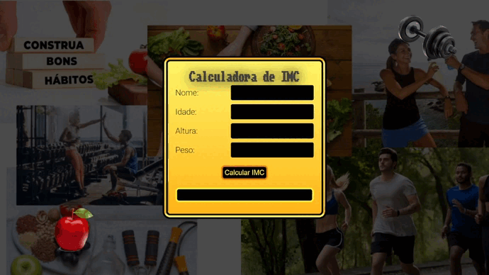

<h1 align="center"> Projeto Calculadora de IMC</h1>

  <a href="#-tecnologias">Tecnologias</a>&nbsp;&nbsp;&nbsp;|&nbsp;&nbsp;&nbsp;
  <a href="#-projeto">Projeto</a>&nbsp;&nbsp;&nbsp;|&nbsp;&nbsp;&nbsp;
  <a href="#memo-licença">Licença</a>

  

 

  

## 💻 Projeto

Este é um projeto de Cauculadora de IMC, como se fosse um aplicativo de saúde ou de academia, tentando causar o máximo de interatividade com o cliente, guardando seu nome, idade e cauculando o IMC através das informações de peso e altura. Com base nas informações o aplicativo irá mostrar se a pessoa está:

- Muito abaixo do Peso
- Abaixo do Peso
- Peso Normal
- Acima do Peso
- Obesidade grau I
- Obesidade grau II
- Obesidade grau III

E dependendo do nível do peso irá também orientar que a pessoa procure um especialista da área da saúde para se cuidar.

## 🚀 Tecnologias

Esse projeto foi desenvolvido com as seguintes tecnologias:

- HTML e CSS
- JavaScript
- Git e Github
- Figma

